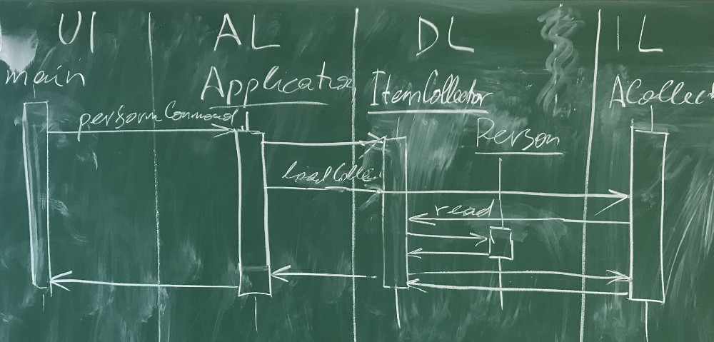

Министерство науки и высшего образования Российской Федерации  
Федеральное государственное бюджетное образовательное учреждение  
высшего образования  
«Московский государственный технический университет  
имени Н.Э. Баумана  
(национальный исследовательский университет)»  
(МГТУ им. Н.Э. Баумана)

ФАКУЛЬТЕТ ИНФОРМАТИКА И СИСТЕМЫ УПРАВЛЕНИЯ  
КАФЕДРА КОМПЬЮТЕРНЫЕ СИСТЕМЫ И СЕТИ (ИУ6)

 

ОТЧЕТ  
к лабораторной работе №1  
по дисциплине "Современные технологии разработки  
программного обеспечения"  
Реализация приложения в многоуровневой архитектуре  
с использованием удалённого репозитория кода

 

Преподаватель: Фетисов М.В.

Студент группы ИУ6-59Б Иванов Иван Иванович.

## Описание задания

Задача № 0: "Мои друзья".

Вариант задания № 0: Постройте диаграмму последовательности выполнения команды load. Диаграмма должна показывать прохождение выполнения команды между программными объектами, расположенными в соответствующих слоях многоуровневой архитектуры.

## Адрес проекта

Проект хранится в репозитории по адресу: [https://gitlab.bmstu.ru/msdt/samples/labs/l1](https://gitlab.bmstu.ru/msdt/samples/labs/l1).

## Документация 

[Диаграммы классов создаются автоматически при обновлении ветки main в удаленном репозитории GitLab и выкладываются в "страницы" проекта](https://l1-msdt-samples-labs-dc643b9c50ba57287fddfb4b7e61afbb866eee9e48.gitlab.bmstu.ru:8443//index.html).

[Отчёт о покрытии тестами создаётся автоматически при обновлении ветки main в удаленном репозитории GitLab и выкладываются в "страницы" проекта](https://l1-msdt-samples-labs-dc643b9c50ba57287fddfb4b7e61afbb866eee9e48.gitlab.bmstu.ru:8443//coverage).

## Диаграмма последовательности

Последовательность выполнения команды load:

## Выводы

?
